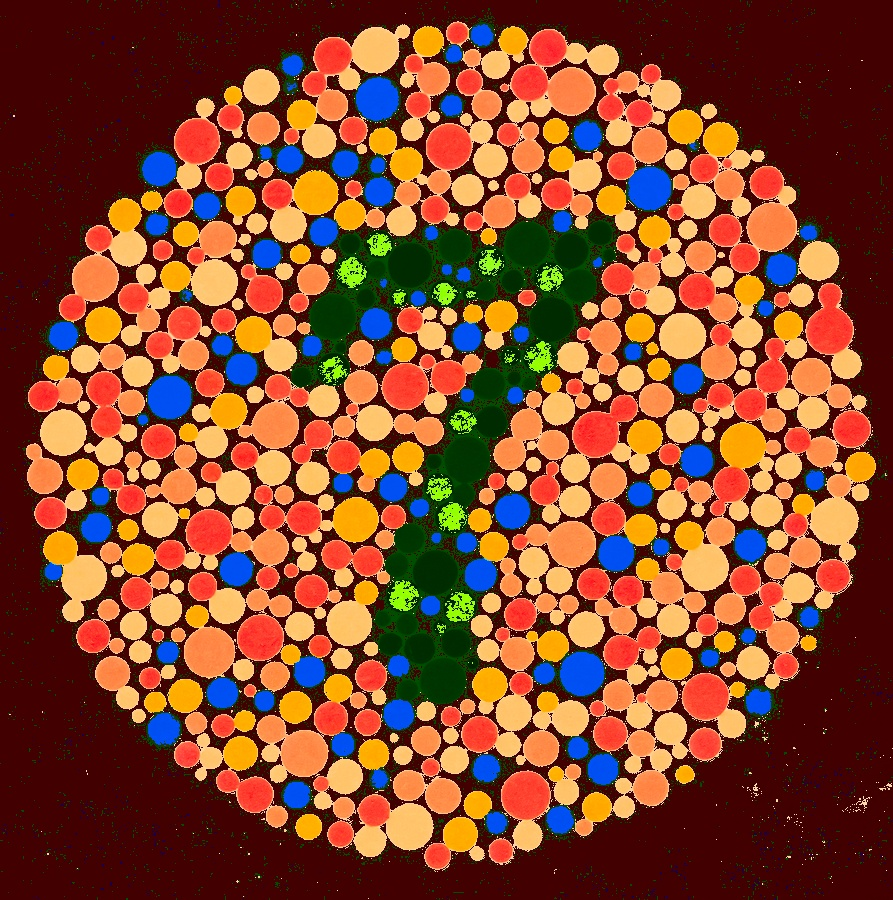
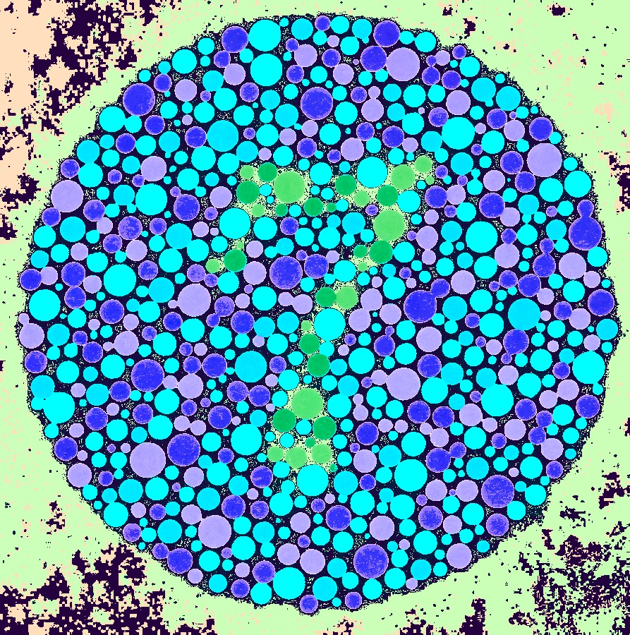

# Colorblind

Colorblind is a computer vision library that converts images into a
colorblind friendly version depending on the type of colorblindness.
The three supported types of colorblindness/color weakness are:

* Deuteranopia: red-green weakness, particularly green
* Protanopia: red-green weakness, particularly red
* Tritanopia: blue weakness

So far we provide three algorithms to correct the images:

* Daltonization: Original method for generating colorblind-friendly images
* HSV Hue Shift: Shifts Hue based on green ratio or blue ratio (depending on colorblindness type)
* Color-Blind Filter Service (CBFS): A little hit or miss based on my implementation
* LAB Shift: Previous studies for this had to tune hyperparameters to get good results

## Installation

```
pip install colorblind
```

## Usage
```
# imports
import numpy as np
import cv2
from colorblind import colorblind
import matplotlib.pyplot as plt

# load image
img = cv2.imread('../images/seven.jpg')
img = img[..., ::-1]

# simulate protanopia
simulated_img = colorblind.simulate_colorblindness(img, colorblind_type='protanopia')

# correct using daltonization
daltonized_img = colorblind.daltonize_correct(img, colorblind_type='protanopia')

# correct using hsv correction
hsv_img = colorblind.hsv_color_correct(img, colorblind_type='protanopia')

# correct using CBFS
cbfs_img = colorblind.cbfs_correct(img, closeness=70)

# correct using LAB color correction
lab_img = colorblind.lab_correct(img, shift=30, ratio=0.1, colorblind_type='protanopia')
```

## Results

### Deuteranopia
| Type | Original | Daltonization | HSV Corrected | LAB Corrected | CBFS (HSL) Corrected |
|----------|------------|---------------|---------------|---------|------------|
| Full Color | |  |  |  |  |
| Simulated Deuteranopia |  |  |  |  |  |

### Protanopia
| Type | Original | Daltonization | HSV Corrected | LAB Corrected | CBFS (HSL) Corrected |
|----------|------------|---------------|---------------|---------|------------|
| Full Color | |  |  |  |  |
| Simulated Protanopia |  |  |  |  |  |

### Tritanopia
| Type | Original | Daltonization | HSV Corrected | LAB Corrected | 
|----------|------------|---------------|---------------|---------|
| Full Color | |  |  |  |
| Simulated Tritanopia |  |  |  |  |

## Credits

Mostly inspired by a summary paper of algorithms applicable to making images color-blind friendly.
Example: https://www.researchgate.net/publication/326626897_Smartphone_Based_Image_Color_Correction_for_Color_Blindness

* Color-Blind Filter Service: https://www.researchgate.net/publication/221023903_Efficient_edge-services_for_colorblind_users
* Daltonization: https://ieeexplore.ieee.org/document/5553346
* HSV Color Shift: https://www.researchgate.net/publication/284698928_Shifting_Colors_to_Overcome_not_Realizing_Objects_Problem_due_to_Color_Vision_Deficiency
* LAB Shift: Original source no longer available

Daltonization values came from https://github.com/joergdietrich/daltonize

Further information on color blindness is available at:
* https://ixora.io/projects/colorblindness/color-blindness-simulation-research/
* http://www.daltonize.org/
